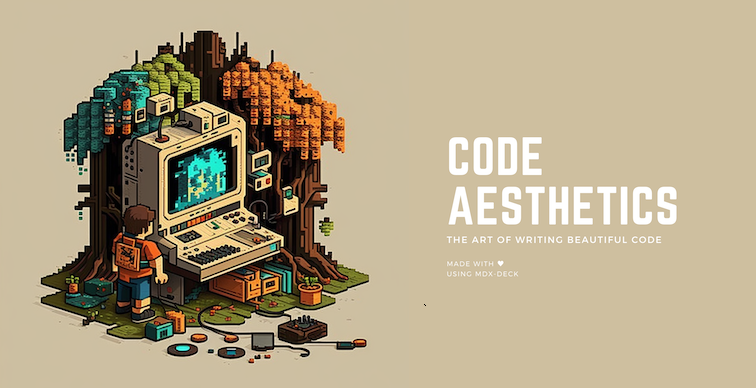

# Code Aesthetics

[](https://app.netlify.com/sites/code-aesthetics/deploys)


Code aesthetics is not just about making your code look pretty, it's about writing code that is easy to read, maintain, and collaborate with others. In this deck, you will learn the key principles of code aesthetics and how to apply them to your own code. We will cover topics such as
 * Naming variables, functions, and 
 * Nesting of code 
 * Commenting and documenting your code
 
Developers are much more similar to artists and inventors than working professionals. Even though every work is a creative endeavour, coding has its brighter sides that it is more evident, urgent and critical in its primary goal and it’s more soothing for developers in the sense of creative satisfaction.

Algorithms, data structures and computational basics are essential aspects, but a more satisfying aspect of coding is its aesthetics. It’s like understanding the skill of drawing and finding unique and individual ways to explore idiosyncratic ways of drawing.

This deck was generated with the `npm init code-surfer-deck` command.

## Presenter Mode

Press `Option + P` to toggle *Presenter Mode*,
which will show a preview of the next slide, a timer, and speaker notes.

The presentation can be opened in two separate windows at the same time,
and it will stay in sync with the other window.

## Keyboard Shortcuts

| Key         | Description                                  |
| ----------- | -------------------------------------------- |
| Left Arrow, Page Up, Shift + Space  | Go to previous slide (or step in [Steps][]) |
| Right Arrow, Page Down, Space | Go to next slide (or step in [Steps][])     |
| Option + P  | Toggle [Presenter Mode](https://github.com/jxnblk/mdx-deck?tab=readme-ov-file#presenter-mode)     |
| Option + O  | Toggle Overview Mode
| Option + G  | Toggle Grid Mode

## Development

To run the presentation deck in development mode:

```sh
npm start
```

Edit the [`deck.mdx`](deck.mdx) file to make changes.

## Exporting

To build the presentation deck:

```sh
npm run build
```

For more documentation see [MDX Deck](https://github.com/jxnblk/mdx-deck) and [Code Surfer](https://codesurfer.pomb.us/)

<a href="https://www.buymeacoffee.com/kuncheria" target="_blank"></a>
